# LD SEO Skill Architecture Diagrams

These diagrams explain how the repo-local LD SEO skills work across routing, MCPs, external APIs, scripts, cached exports, validation, Codex judgement, and client-facing outputs.

Canonical behaviour still lives in:

- [`docs/agent/skills/_index.md`](skills/_index.md)
- [`docs/agent/skills/_routing-contract.md`](skills/_routing-contract.md)
- [`docs/agent/workflows/_index.md`](workflows/_index.md)
- The individual skill and workflow files linked below

Use these diagrams as an operating map, not as a replacement for the workflow playbooks.

## Legend

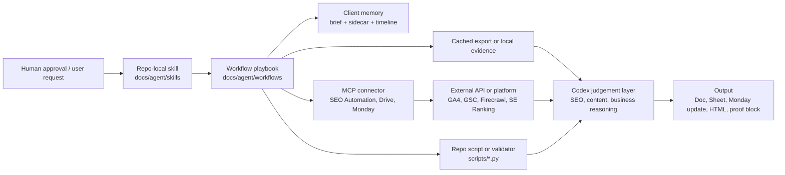

## Whole System

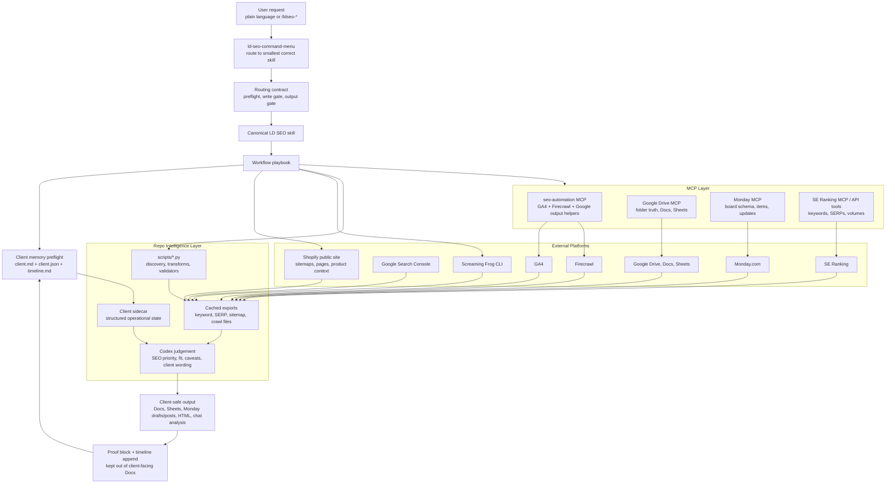

## Routing And Safety Gates

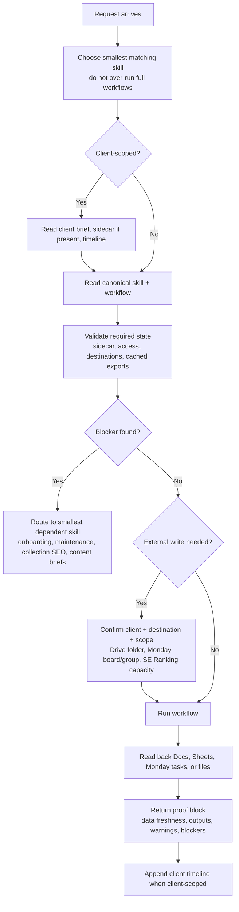

## `ld-seo-command-menu`

Routes a request to the correct canonical skill and workflow. See [`ld-seo-command-menu/SKILL.md`](skills/ld-seo-command-menu/SKILL.md).

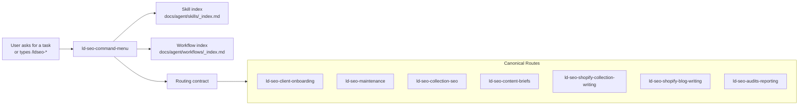

## `ld-seo-client-onboarding`

Sets up valid client state before delivery work. See [`ld-seo-client-onboarding/SKILL.md`](skills/ld-seo-client-onboarding/SKILL.md) and [`add-new-client.md`](workflows/add-new-client.md).

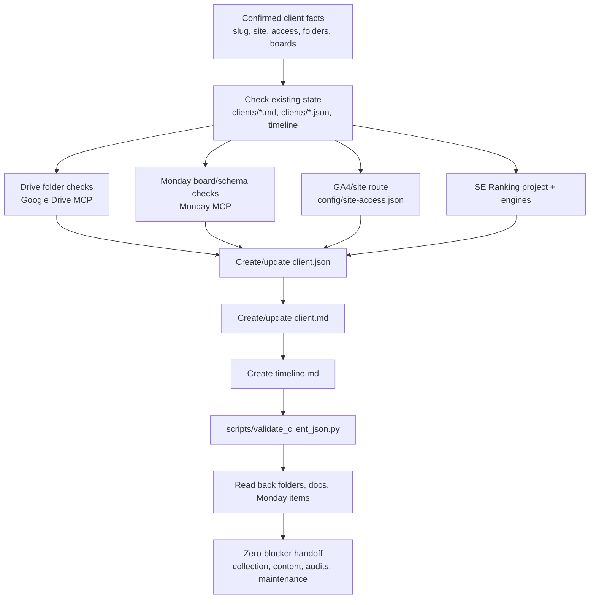

## `ld-seo-maintenance`

Diagnoses platform state, access, filing, SE Ranking capacity, and credential problems. See [`ld-seo-maintenance/SKILL.md`](skills/ld-seo-maintenance/SKILL.md), [`troubleshoot-access.md`](workflows/troubleshoot-access.md), and [`se-ranking-hygiene.md`](workflows/se-ranking-hygiene.md).

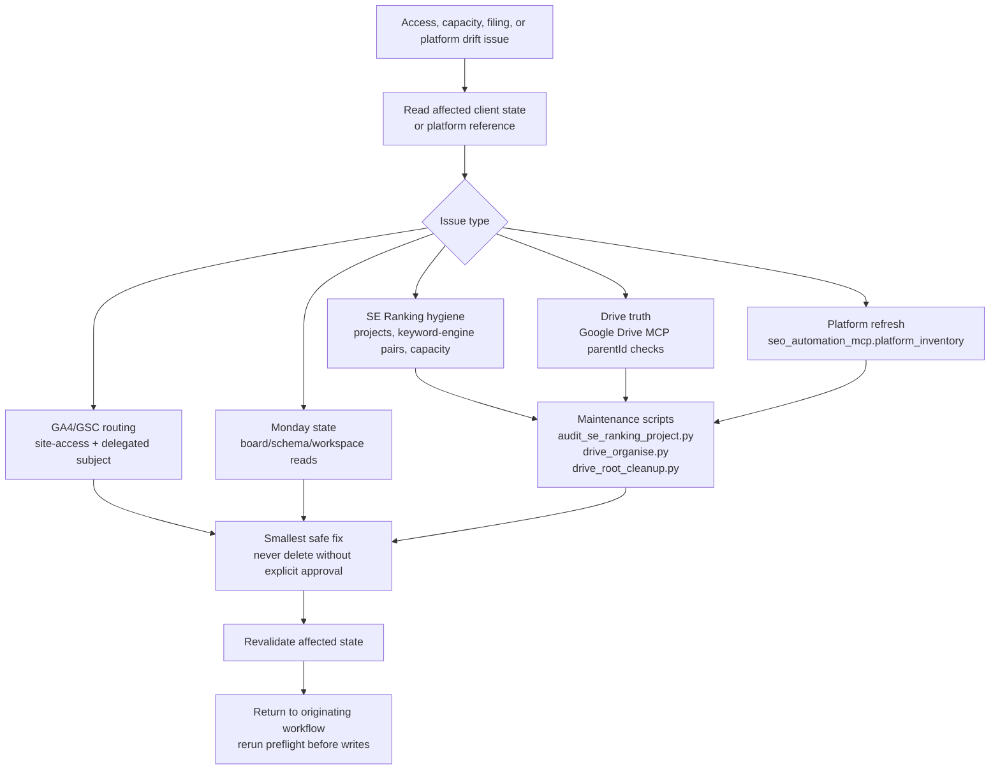

## `ld-seo-collection-seo`

Runs collection discovery, keyword research, SERP review, metadata generation, Sheet output, and Monday handoff. See [`ld-seo-collection-seo/SKILL.md`](skills/ld-seo-collection-seo/SKILL.md), [`collection-seo-full.md`](workflows/collection-seo-full.md), [`keyword-research-collections.md`](workflows/keyword-research-collections.md), [`competitor-keyword-research.md`](workflows/competitor-keyword-research.md), and [`onpage-title-h1-suggestions.md`](workflows/onpage-title-h1-suggestions.md).

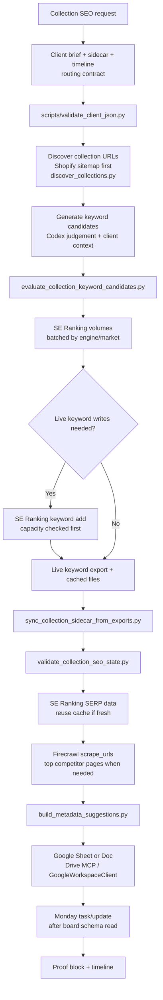

## `ld-seo-content-briefs`

Creates writer-ready Shopify collection briefs from validated collection SEO state. See [`ld-seo-content-briefs/SKILL.md`](skills/ld-seo-content-briefs/SKILL.md), [`shopify-collection-content-briefs/SKILL.md`](skills/shopify-collection-content-briefs/SKILL.md), and [`collection-content-briefs.md`](workflows/collection-content-briefs.md).

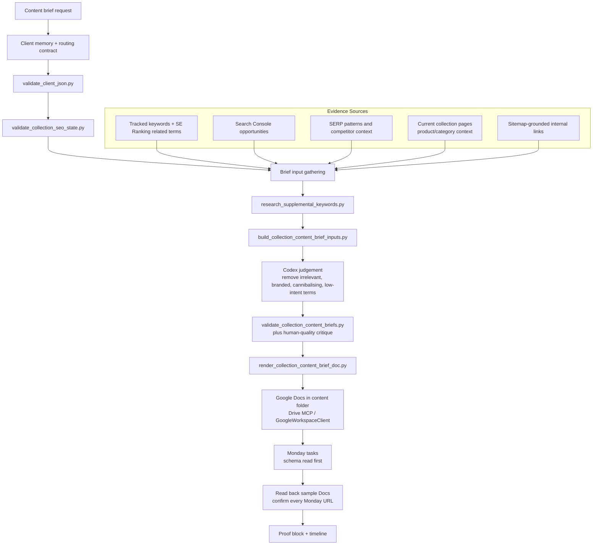

## `ld-seo-shopify-collection-writing`

Turns an approved collection brief into publish-ready Shopify collection body HTML. See [`ld-seo-shopify-collection-writing/SKILL.md`](skills/ld-seo-shopify-collection-writing/SKILL.md) and [`collection-content-writing.md`](workflows/collection-content-writing.md).

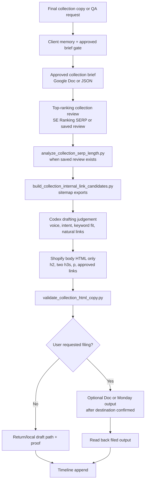

## `ld-seo-shopify-blog-writing`

Turns an approved blog brief into publish-ready Shopify article HTML. See [`ld-seo-shopify-blog-writing/SKILL.md`](skills/ld-seo-shopify-blog-writing/SKILL.md) and [`blog-content-writing.md`](workflows/blog-content-writing.md).

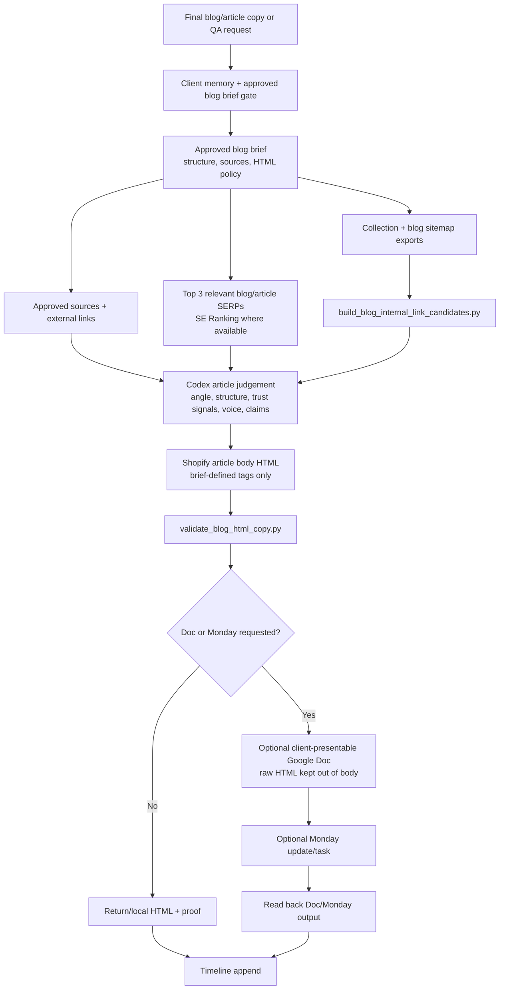

## `ld-seo-audits-reporting`

Handles single-page audits, full technical audits, traffic checks, monthly performance comments, and explicit Doc + Sheet reports. See [`ld-seo-audits-reporting/SKILL.md`](skills/ld-seo-audits-reporting/SKILL.md), [`single-page-audit.md`](workflows/single-page-audit.md), [`full-site-audit.md`](workflows/full-site-audit.md), [`ga4-traffic-check.md`](workflows/ga4-traffic-check.md), [`monthly-performance-comment.md`](workflows/monthly-performance-comment.md), and [`monthly-combined-report.md`](workflows/monthly-combined-report.md).

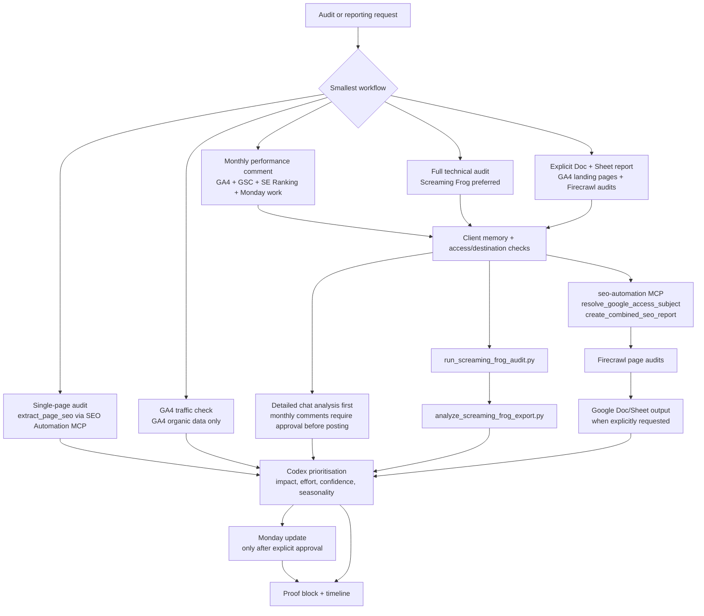

## Data Lineage

This shows where evidence is allowed to come from and where it can land.

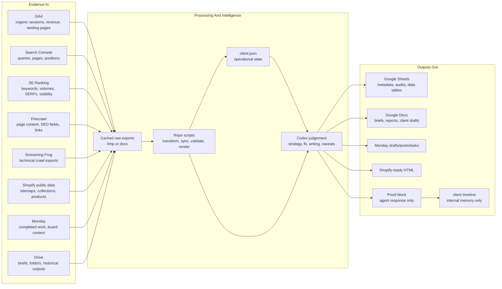

## Write Approval Boundaries

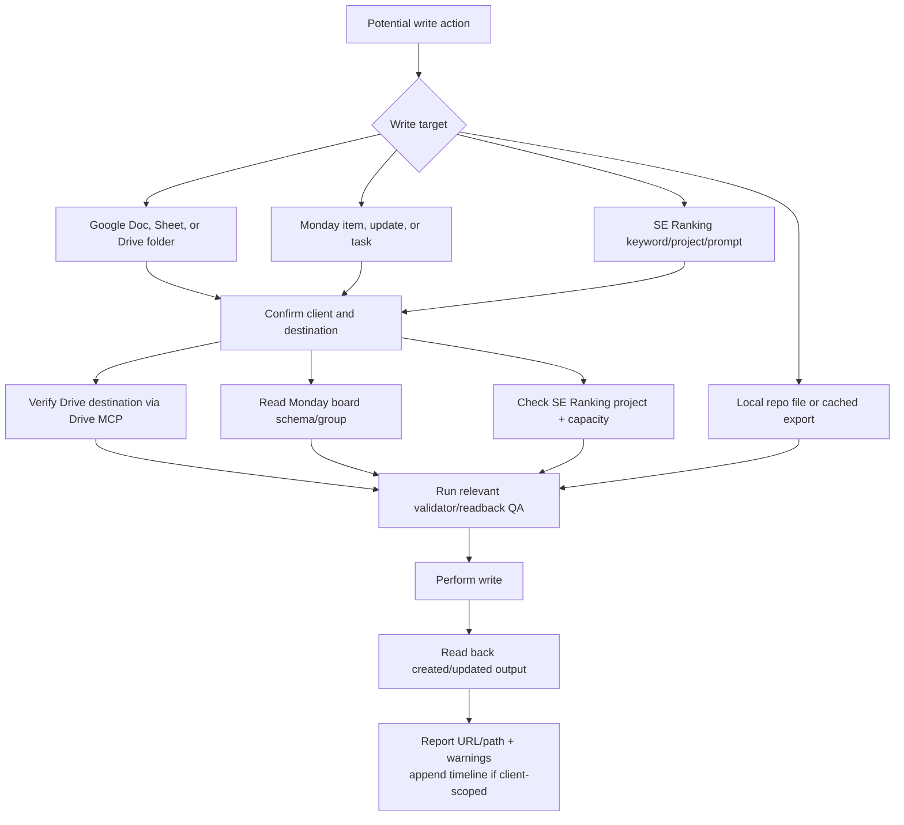

## Keeping These Diagrams Current

- Update this file when a canonical skill adds or removes a platform dependency, write gate, or validator.
- Do not document secrets, API keys, service-account JSON contents, or raw credentials here.
- Do not copy full workflow steps into diagrams; link to the workflow and show the operational architecture.
- Keep client-facing proof language out of Google Docs and Sheets. Proof blocks belong in agent responses, local validation artifacts, or Monday only when appropriate.
